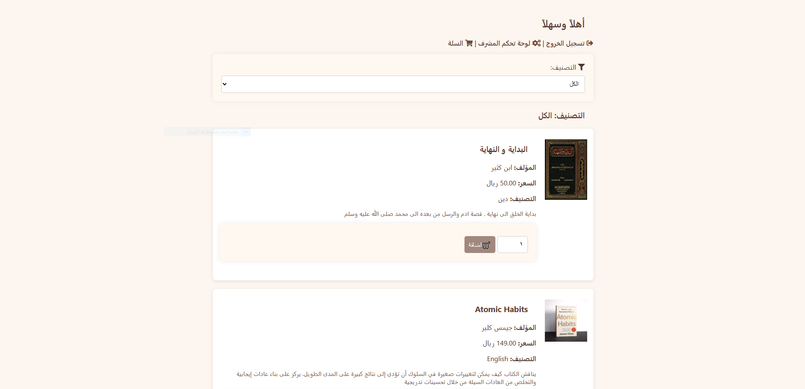

# Bookstore Project

This is an online bookstore created as part of a university project that allows users to browse books, search for them, filter them by category, and read summaries of each book. Users can also add books to their shopping cart and proceed with the purchase process. The site includes an admin dashboard that allows administrators to manage the catalog, including adding, editing, and deleting books, all in arabic.

## Features:
- **Account Management:** Users can create a new account or log in.
- **Book Listings:** Browse books with details such as title, author, price, and category.
- **Shopping Cart:** Add books to the cart and complete the checkout process.
- **Book Categorization:** Filter books by genre or category for easier browsing.
- **Admin Dashboard:** Admins can manage the catalog (add, edit, delete books).
- **Order Confirmation:** After confirming the order, the cart is cleared, and the order is recorded in the database.

## Database Setup:
1. Open phpMyAdmin after starting XAMPP.
2. Create a new database.
3. Upload the provided SQL file (bookstore) located in the folder.
    - If you encounter an issue uploading the file, you can create a new database and then copy the SQL code (from the bookstore folder) and paste it into phpMyAdmin.

## Running the Project:
1. Ensure Apache and MySQL are running in XAMPP.
2. Place the project files in the `htdocs` folder inside your XAMPP directory.
3. Import the database:
   - Open phpMyAdmin and upload the SQL file.
4. Open your browser and go to [http://localhost/store/index.php].

## Requirements:
- PHP 7.x or higher
- MySQL
- XAMPP (with Apache and MySQL running)

## FAQ:
- **The admin is added directly from the database.**

##

